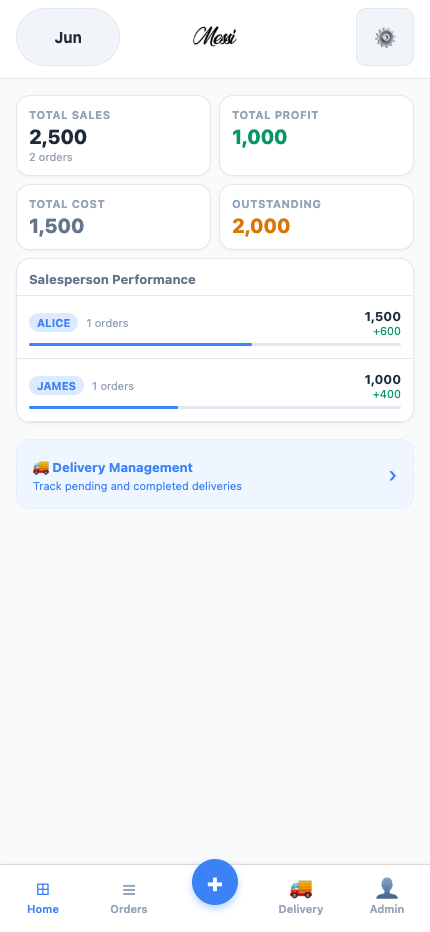
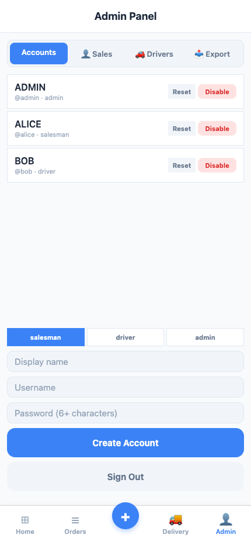
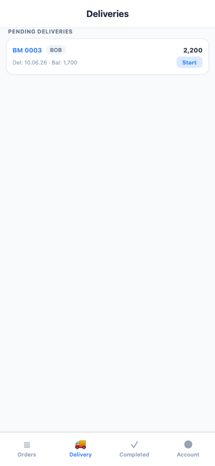

# MESSI Sales Management

A role-based sales, order, and delivery management app built with React Native,
Expo, TypeScript, and SQLite.



## Product Overview

MESSI Sales Management replaces scattered order tracking with one focused
workflow for office administrators, salespeople, and delivery drivers.

- **Admin** manages accounts, orders, payments, delivery assignments, and
  company-wide performance.
- **Salesman** creates orders and sees only personal orders and sales totals.
- **Driver** sees assigned deliveries, updates delivery progress, and moves
  completed jobs into a delivery history.

## Demo

Default administrator account:

```text
Username: admin
Password: admin123
```

The demo stores data locally in the browser or device. No real customer data is
included.

## Highlights

- Role-based login and persistent sessions
- Admin account creation, disabling, and password reset
- Order creation, editing, deletion, payment history, and live calculations
- Monthly sales, cost, profit, and outstanding-balance summaries
- Salesman-specific order and performance views
- Driver-specific assigned-delivery workflow
- Pending, out-for-delivery, and completed delivery states
- SQLite persistence with schema migration and transaction support
- Responsive Web, iOS, and Android interface from one codebase

## Screens

| Admin dashboard | Account management | Driver delivery |
| --- | --- | --- |
|  |  |  |

## Tech Stack

- React Native 0.81
- Expo SDK 54
- TypeScript
- Expo SQLite
- React Navigation
- AsyncStorage

## Run Locally

Requirements: Node.js 20+ and npm.

```bash
npm install
npm run web
```

For mobile development:

```bash
npm run ios
npm run android
```

## Production Build

```bash
npm run build:web
```

The static output is written to `dist/` and can be deployed to Netlify, Vercel,
Cloudflare Pages, or another static host.

### Fastest Netlify Deployment

1. Run `npm run build:web`.
2. Zip the contents of `dist/`.
3. Drag the ZIP onto [Netlify Drop](https://app.netlify.com/drop).

The included `_headers` file enables the browser isolation required by Expo
SQLite.

## Verification

```bash
npm run typecheck
npm run build:web
```

The role workflows were also verified end-to-end in a browser:

1. Admin creates salesman and driver accounts.
2. Admin creates an order and assigns both roles.
3. Salesman sees only the assigned personal order and cannot access company
   profit, costing, editing, deletion, or account management.
4. Driver sees only the assigned delivery, marks it in progress, completes it,
   and finds it in the Completed view.

## Vibe Coding Process

This project was developed through an AI-assisted workflow:

1. Turned business requirements into role and permission rules.
2. Extended an existing Expo prototype instead of replacing its architecture.
3. Added authentication, database migrations, and role-aware navigation.
4. Used TypeScript checks and browser automation to validate behavior.
5. Found and fixed a SQLite race where two providers could open the same
   database concurrently.
6. Tested the complete Admin → Salesman → Driver workflow rather than stopping
   at visual implementation.

The AI accelerated implementation, while product decisions, permission design,
testing scope, and acceptance criteria remained deliberate engineering choices.

## Current Scope

This version is local-first and intended for a single browser or device.
Production multi-device use would require a hosted authentication and database
service such as Supabase, plus server-side authorization.

## Demo Walkthrough

See [docs/DEMO.md](docs/DEMO.md) for a concise presentation script.
